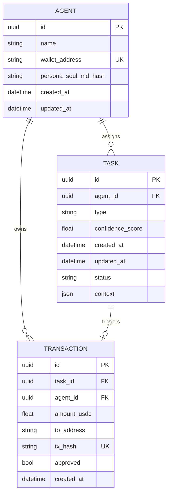

# Technical Specifications

## API Contracts (Pydantic Schemas)

### Task Payload

```python
from pydantic import BaseModel, UUID4
from datetime import datetime

class AgentTask(BaseModel):
    task_id: UUID4
    task_type: str  # e.g., "generate_content"
    priority: str  # "high|medium|low"
    context: dict  # {"goal": str, "persona_constraints": list[str]}
    assigned_worker_id: str
    created_at: datetime
    status: str  # "pending|in_progress|review|complete"
```

### Trend Fetcher API

```python
from pydantic import BaseModel
from typing import List, Dict, Any

class TrendInput(BaseModel):
    query: str  # e.g., "fashion Ethiopia"
    limit: int = 5  # Maximum number of trends to return

class TrendOutput(BaseModel):
    trends: List[Dict[str, Any]]  # [{"topic": str, "relevance": float, "source": str}]
```

### Content Generator API

```python
from pydantic import BaseModel
from typing import Literal

class ContentInput(BaseModel):
    type: Literal["text", "image", "video"]
    prompt: str
    persona_id: str

class ContentOutput(BaseModel):
    artifact_url: str
    confidence: float  # 0.0 to 1.0
```

### Transaction Executor API

```python
from pydantic import BaseModel

class TxInput(BaseModel):
    to_address: str  # Ethereum address
    amount_usdc: float  # Amount in USDC

class TxOutput(BaseModel):
    tx_hash: str  # Transaction hash
    success: bool
```

### Error Response Schema

```python
from pydantic import BaseModel
from typing import Optional

class ErrorResponse(BaseModel):
    error_code: str
    message: str
    details: Optional[dict] = None
```

## Database Schema (ERD)



### Database Indexes

- `AGENT.wallet_address` - Unique index for wallet lookups
- `TASK.agent_id` - Index for agent task queries
- `TASK.status` - Index for status filtering
- `TASK.created_at` - Index for time-based queries
- `TRANSACTION.tx_hash` - Unique index for transaction lookups
- `TRANSACTION.agent_id` - Index for agent transaction history

### Database Constraints

- `TASK.confidence_score` - CHECK constraint: 0.0 <= confidence_score <= 1.0
- `TASK.status` - CHECK constraint: status IN ('pending', 'in_progress', 'review', 'complete', 'failed')
- `TRANSACTION.amount_usdc` - CHECK constraint: amount_usdc > 0

## MCP Tool Definitions

### post_content Tool

```json
{
  "name": "post_content",
  "description": "Publishes content to social platform",
  "inputSchema": {
    "type": "object",
    "properties": {
      "platform": {
        "type": "string",
        "enum": ["twitter", "instagram", "tiktok"]
      },
      "text": {
        "type": "string",
        "minLength": 1,
        "maxLength": 280
      },
      "media_urls": {
        "type": "array",
        "items": {
          "type": "string",
          "format": "uri"
        },
        "maxItems": 4
      }
    },
    "required": ["platform", "text"]
  }
}
```

### fetch_trends Tool

```json
{
  "name": "fetch_trends",
  "description": "Fetches semantic trends via MCP resources",
  "inputSchema": {
    "type": "object",
    "properties": {
      "query": {
        "type": "string",
        "minLength": 1
      },
      "limit": {
        "type": "integer",
        "minimum": 1,
        "maximum": 50,
        "default": 5
      },
      "source": {
        "type": "string",
        "enum": ["news", "social", "all"],
        "default": "all"
      }
    },
    "required": ["query"]
  }
}
```

### generate_content Tool

```json
{
  "name": "generate_content",
  "description": "Generates multi-modal content with consistency lock",
  "inputSchema": {
    "type": "object",
    "properties": {
      "type": {
        "type": "string",
        "enum": ["text", "image", "video"]
      },
      "prompt": {
        "type": "string",
        "minLength": 1
      },
      "persona_id": {
        "type": "string"
      }
    },
    "required": ["type", "prompt", "persona_id"]
  }
}
```

### execute_transaction Tool

```json
{
  "name": "execute_transaction",
  "description": "Executes on-chain transaction via Coinbase AgentKit",
  "inputSchema": {
    "type": "object",
    "properties": {
      "to_address": {
        "type": "string",
        "pattern": "^0x[a-fA-F0-9]{40}$"
      },
      "amount_usdc": {
        "type": "number",
        "minimum": 0.01
      }
    },
    "required": ["to_address", "amount_usdc"]
  }
}
```

### get_agent_status Resource

```json
{
  "uri": "agent://status/{agent_id}",
  "mimeType": "application/json",
  "name": "Agent Status",
  "description": "Returns current status and capabilities of an agent",
  "schema": {
    "type": "object",
    "properties": {
      "agent_id": {
        "type": "string"
      },
      "available": {
        "type": "boolean"
      },
      "skills": {
        "type": "array",
        "items": {
          "type": "string"
        }
      },
      "current_tasks": {
        "type": "integer"
      },
      "last_heartbeat": {
        "type": "string",
        "format": "date-time"
      }
    },
    "required": ["agent_id", "available", "skills"]
  }
}
```

# Technical Specification

Architecture, APIs, data models, and implementation notes.
